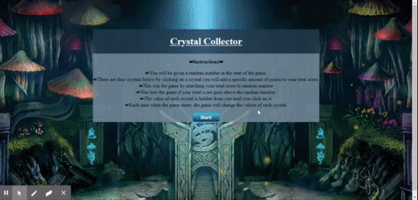

# React-Crystals

# Built with React

* Crystal game where you have to guess the number that each crystal represent and add them to match a given random number.

## Getting Started

## Rules of the Game
This is a pretty straightforward memory challenge game. Click on a Crystal. Each time you click, your score will go up by a random number between 1-10 this is the value of the crystal. If you match the given score, you win! otherwise if you go over the given number you lose, all the numbers will be randomly shuffled each game. Good luck!

## Contributing to development
## Prerequisites
* Node installed on your local machine

## Installing
Follow the instructions in this section to get the app setup to run on your machine.

Clone the git project to your machine (example below is using ssh)

git clone 'git@github.com:jm27/React-Crystals.git'
Install the node module dependencies from the package.json file

npm install

Usage

npm run start

## Deploying to Github Pages

If you want to deploy a production version to Github Pages, there is a gh-pages package installed as part of the package.json packages that will help with that deploy. Follow the steps below:

Update the package.json file and change the "homepage" entry

Update the URL to your project site on Github Pages

"homepage": "https://jm27.github.io/React-Crystals/",
Run the command to use gh-pages to deploy to the Github Pages site

npm run deploy
This will run the deploy script from the package.json file which will build the react app and then push it to Github Pages.
This will publish it based on the homepage url.

[Crystals-Game DEPLOYED LINK](http://jm27.github.io/React-Crystals "Homepage")
======

* Deployed using Github Pages.

## Built With

* HTML.
* CSS.
* BOOTSTRAP.
* JAVASCRIPT.
* REACT.
# Dependencies

* "gh-pages": "^2.2.0",
* "react": "^16.12.0",
* "react-dom": "^16.12.0",
* "react-scripts": "3.3.0"

## Versioning
Crystals-Game V1.0.1

## Authors

* **Jesus Esquer** - *Main Contributor* - [jm27](https://github.com/jm27)

## Acknowledgments

* Thanks to Classmates, Instructors, and TA's .
* Bootcamp 2019-2020.

